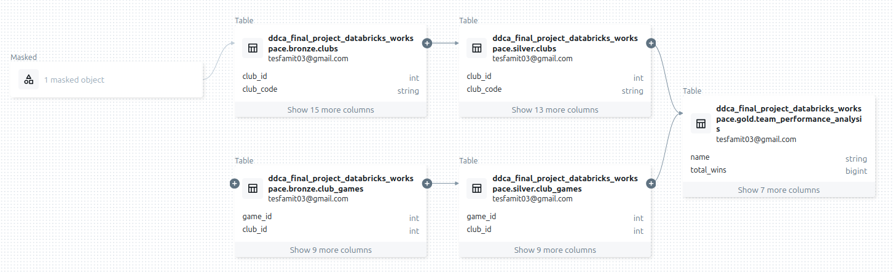

# Automated ETL for Football Analytics: Player Valuation, Team Performance, and Transfer Trends

**Team 4**:
1. Abu Saleh 
2. Tesfay Tesfay 

**Contributions**:
1. **Abu Saleh**: contributed to the project by helping develop the initial idea, selecting the dataset, and planning the overall process pipeline.

2. **Tesfay Tesfay**: was responsible for designing and implementing the data pipeline, developing the entire codebase, testing the end-to-end workflow, writing the documentations and reports, and managing the repository structure. 

--- 

## **1. Introduction**

In this project, we implement an ETL (Extract, Transform, Load) pipeline designed to analyze football player statistics, predict player market valuation, analyze team performance, and track transfer trends. The pipeline integrates Azure Data Lake Storage (ADLS), Azure Data Factory (ADF), and Azure Databricks to automate data ingestion, transformation, and storage processes.

Football is one of the most watched sports games in the world. While the fans use football for entertainment, it is a core business for others. So, data-driven insights are essential for assessing team performance, predicting player market valuation, and understanding team dynamics. This project presents an automated ETL pipeline that extracts raw football data from GitHub, transforms it using Databricks, and manages the data within Databricks at three distinct layers to enable predictive modeling and analysis.

More of the analysis and visualizations can be found at:[analysis_results_with_visualization.md](docs/analysis_results_with_visualization.md)

## **2. System Architecture**

The ETL pipeline follows a structured flow:

1. **Data Extraction:** Weekly updates of football statistics and transfer data are pulled from GitHub.
2. **Data Storage:** The raw CSV files are stored in ADLS as a centralized data repository.
3. **Data Transformation:** Azure Databricks processes and transforms the raw football data.
4. **Data Management:** The data are saved in three different layers within Databricks:
- Bronze Layer: Raw data stored as-is.
- Silver Layer: Cleaned and transformed data.
- Gold Layer: Analytics-ready data optimized for predictive modeling and insights.
5. **Automation & Scheduling:** Azure Data Factory is used to automate data pulling from GitHub, while the other pipeline processes are automated using the Databricks job scheduler.

## **3. Implementation Details**

### **3.1 Data Extraction Using Azure Data Factory**
- Initially, manual uploads to Azure Data Lake Storage (ADLS) were employed for initial dataset ingestion. However, given the dataset's weekly update frequency, Azure Data Factory was implemented to automate the data extraction and loading process to ensure consistent updates.
- Azure Data Factory is configured with a pipeline that automatically triggers data pulling from GitHub to store in a defined container.
- The dataset is updated weekly, so a scheduled trigger is implemented in ADF.
- The ADF is configured to copy data from GitHub as a batch process.

--- 

### **3.2 Data Transformation Using Azure Databricks**

- A Databricks notebook is employed for data ingestion and processing.
- Data cleaning includes handling missing values, duplicate records, and data type conversions, applied in the Silver layer.
- Feature engineering techniques are applied at the Gold layer of the medallion architecture to derive insights related to player valuation, team performance, and transfer trends.
- The Medallion architecture is implemented within Databricks.
- In every layer of the medallion architecture, data is written to a Delta Lake table using the mergeSchema option, enabling automatic schema evolution as the dataset structure may change over time.

Azure Databricks automates data processing through a layered architecture. First, data is ingested in batches from Azure Data Lake Storage (ADLS) into the Bronze layer. Upon successful ingestion, the Silver layer cleans and transforms this data, incorporating automated schema testing to ensure data quality. Finally, the Gold layer immediately processes the refined Silver layer data, producing analytics-ready and machine-learning-friendly data. Following this, a machine-learning model is executed. The entire workflow is automated and orchestrated by the Azure Databricks Job Scheduler.

The machine learning component in the pipeline predicts player market values using features such as performance statistics, physical attributes, the player's age, and contract details. The model is trained using XGBoost, and performance metrics are logged using MLflow for tracking and reproducibility.

### **3.3 Data Storage and Management in Databricks**

- The raw data remains in ADLS. 
- For storage purposes, Delta tables are used for efficient querying and analytics within Databricks.

## **4. Dataset**
The dataset is sourced from [Kaggle](https://www.kaggle.com/datasets/davidcariboo/player-scores) consists of multiple CSV files containing appearances, player valuations, players, competitions, games, and clubs. The original dataset from Kaggle has an automatic weekly update. Each file has different entities and IDs that facilitate data integration. For details about the data schema, please check the . 

For this project, to reduce the dataset size, we sampled records from 2020 to the present. 

---

*Image source: [Kaggle](https://www.kaggle.com/datasets/davidcariboo/player-scores)*

## **5. Data Lineage**
We saved the data of the whole medallion architecture (Bronze, Silver, and Gold layers) at different layers at Azure Databricks but not ADLS because it was easier for us to use Databricks to trace and visualize the data's journey from its origins to its destination. In this section, we tried to show two sample data lineage visualizations to show the reader how the actual work was done. 

Data Lineage for Team Performance:
---

---

Data Lineage for Player Statistics and Valuation:

## **6. Pipeline Statistics**
A dedicated Delta Lake table was created to capture comprehensive pipeline statistics, enabling strong monitoring and auditing of data processing activities within the bronze and silver layers. These tables store information, including record counts for ingested and cleaned data, file sizes, and the respective ingestion and cleaning durations, enabling granular performance analysis and operational insights. For sample pipeline statistics check [sample_bronze_layer_pipeline_stats.csv](data/sample_bronze_layer_pipeline_stats.csv) or [sample_silver_layer_pipeline_stats.csv](data/sample_silver_layer_pipeline_stats.csv). 

For more visualizations on the pipeline statistics check [pipeline_stats.md](docs/pipeline_stats.md).

## **7. Basic Metadata** 
The basic metadata of the schema have also been saved in a dedicated Delta Lake table likewise the pipeline statistics for accessibility and simplicity. The table contains the schema name, column names, table names and data types of the columns. Check [sample_metadata.csv](data/sample_metadata.csv) for sample. 

## **8. Performance Tuning** 
Z-ordering was applied to the Gold Layer tables to optimize query performance and ensure efficient data retrieval. Z-Ordering organizes data based on one or more columns (e.g., player_id, market_value_in_eur) so that related records are stored close together. 
### **9. Access the Data Product through API**
To enable seamless access to the processed data products, we implemented an API-like mechanism using the Databricks SQL Connector. This allows users to query the Delta tables in the projects' cluster catalog programmatically using an access token to authenticate themselves. 
## **10. Data Sharing**
To demonstrate how processed data can be made available to external stakeholders, we used Azure Blob Storage to implement data sharing after the pipeline was finished. As a proof of concept, we chose to demonstrate the ease of use and adaptability of cloud-based data distribution through public data sharing. We uploaded the final aggregated dataset to a specific designated in Azure Blob Storage. To guarantee that the most recent version is always accessible, the file was uploaded programmatically with the option to overwrite existing data. For ease of access, we created a public URL for the uploaded file, which enables anyone with the link to download and use the information. Although we did it this way for demonstration, access control mechanisms must be implemented in production to secure sensitive data in a production environment. 
