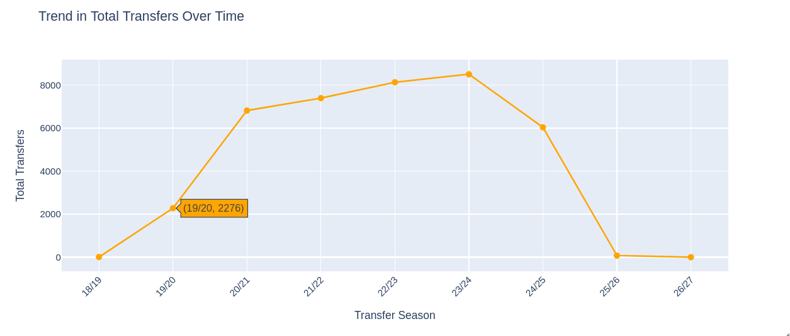

# Analysis Results with Visualization

This document includes analysis and visualizations derived from the project.

### **Player Valuation Prediction**
The scatter plot below compares actual and predicted player valuations. These results were achieved using the XGBoost model, which attained an accuracy of 75%. This outcome was obtained by integrating features from most delta tables joined at the Gold layer.

---

### **Players**

The graph shown below depicts "Age vs. Market Value" and examines the correlation between a player's age and their market value (in EUR) across four playing positions: Goalkeeper, Midfield, Defender, and Attacker. As shown in the graph, Attackers exhibit the highest market values, particularly peaking in the 20–30 age range, where some individuals exceed 150M EUR. A clear trend emerges where players achieve peak market value during their mid-20s to early 30s, followed by a decline as age advances. However, substantial variability exists within each position, with outliers suggesting that factors beyond age—such as skill, performance metrics, and market demand—significantly influence valuation. 

---

The chart depicted in the graph below compares the average market value (in EUR) across football playing positions: Attack, Midfield, Defender, and Goalkeeper. Attackers show the highest average market value followed by midfielders with a similarly high average value. Defenders show a moderate average value while goalkeepers have the lowest among primary positions. These results illustrate a clear hierarchy in player valuation, emphasizing midfielders and attackers as the most valuable assets.

---

The figure shown below illustrates the relationship between a player's market value (in EUR) and their average minutes played across different playing positions: Attack, Midfield, Defender, and Goalkeeper. The data reveals a general positive correlation, where players with higher average minutes played tend to have higher market values. Attackers and Midfielders exhibit the highest market values, particularly among those who play more than 60–80 average minutes. Defenders also show significant market values within this range, while Goalkeepers generally have lower market values across all playing times. There are outliers, especially among attackers and midfielders, achieving exceptionally high market values even at relatively low playing times, suggesting that other factors might play critical role in the player valuations. Overall, the chart underscores the importance of consistent playing time and positional roles in determining player market value.

---

The bar chart depicted below showcases the market values of the top players from various football clubs, including Manchester City Football Club, Real Madrid Club de Fútbol, Arsenal Football Club, FC Bayern München, Bayer 04 Leverkusen Fußball, and Chelsea Football Club. Erling Haaland leads with a market value of 200M EUR, followed closely by Kylian Mbappé at 180M EUR and Robert Lewandowski at 160M EUR. Other notable players include Bukayo Saka (150M EUR), Phil Foden (140M EUR), Jadon Sancho (140M EUR), Kai Havertz (140M EUR), Sergiño Dest (130M EUR), and Mason Mount (130M EUR). Rice, representing Arsenal  Football Club, has the lowest market value among the listed players at 110M EUR. This graph shows the significant financial disparities between top-tier players. 

---
Moreover, we plot a graph for "Top Players by Total Goals". The graph showed that Robert Lewandowski leads with 220 total goals, followed closely by Erling Haaland at 200 goals and Kylian Mbappé at 180 goals over the last five years.illustrates

---

A pie chart that shows Distribution of Players by Position is shown below. This graph illustrates the proportion of players across different playing positions: Defender, Attack, Midfield, and Goalkeeper. Defenders constitute the largest segment at 32.7%, followed closely by Attackers at 29.6%. Midfielders account for 29% of the total, while Goalkeepers represent a smaller portion at 8.7%.

---
### **Team Performance**

The total number of wins achieved (since January 2020) by top ten football clubs is visualized in the chart below. Real Madrid Club de Fútbol leads with over 500 total wins, followed closely by FC Barcelona and FC Bayern München, both with approximately 480 wins. Manchester City Football Club, The Celtic Football Club, and Juventus Football Club also demonstrate strong performance, each achieving around 420–460 wins. Other teams include Club Atlético de Madrid S.A.D., Sport Lisboa e Benfica, Paris Saint-Germain Football Club, and Liverpool Football Club, all with roughly similar win totals in the range of 400–420. 

---
The bar chart titled "Goals Scored vs. Goals Conceded" compares the number of goals scored and goals conceded by prominent football teams. Real Madrid Club de Fútbol leads in both categories, with over 160 goals scored and approximately 80 goals conceded. FC Barcelona and FC Bayern München also demonstrate strong offensive performance.

---
The Pie chart below illustrates the distribution of match outcomes for the Manchester City FC. Wins constitute the largest portion at 58.4%, representing 463 matches, indicating Manchester City's strong performance and dominance in their competitions. Losses account for 28.6% of the matches, while Draws make up the smallest segment at 13%. This distribution highlights Manchester City's consistent success, with a significant majority of matches resulting in victories.

---

### **Transfer Trends**

The total number of transfers across different football transfer seasons is depicted in the line chart below. The data shows that a general upward trend in the number of transfers over time. The season 23/24 exhibits the highest total transfers, with approximately 8,000 transfers, followed closely by 22/23 at around 7,500. The 24/25 season also shows a high number of transfers, reaching 6,038. In contrast, earlier season like 19/20 have significantly fewer transfers. The most recent seasons (25/26 and 26/27) show a sharp decline.

---
The line chart below shows the "Trend in Average Market Value Over Time". It illustrates the average market value of players across different transfer seasons. The trend begins at a low point in the 18/19 season and gradually increases over the next few seasons. There is a steady rise until the 25/26 season, where the average market value peaks sharply at around 5.5 million EUR. However, in the following season (26/27), there is a significant drop since there is no enough data for that season .

---
The line chart shown below shows the total number of transfers across different football transfer seasons.This document includes analysis and visualizations derived from the project. The trend begins at a low point in the 18/19 season and steadily increases over the next few seasons. This upward trajectory continues until the 23/24 season. However, surprisingly, there is a sharp decline in subsequent seasons, with the 25/26 season showing a significant drop to near zero transfers. The final season (26/27) also exhibits minimal activity might be due to not enough records for this season. 

---

The following graph illustrates the combination of the above two graphs, the trends in average market value (in millions of EUR) and total transfers across different football transfer seasons. 

