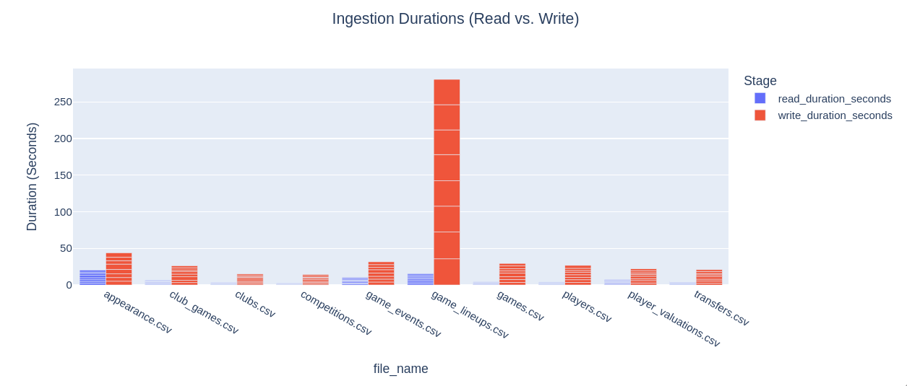
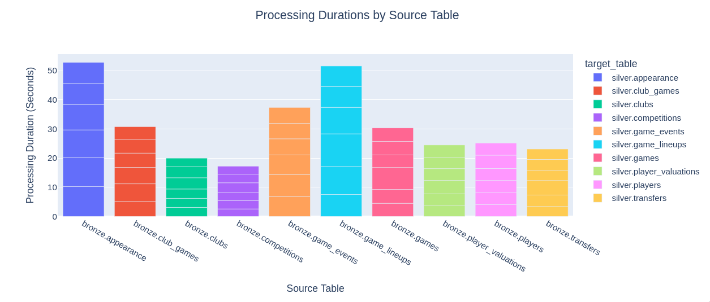
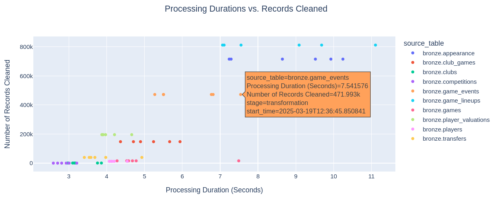

# Pipeline Stats

The bar graph below depicts the read and write durations for various CSV files during a data ingestion process. As the graph indicates, the `game_lineups.csv` file exhibits a high write duration. In contrast, most other files demonstrate relatively balanced and shorter durations for both reading and writing operations. The observed pattern indicates that while read operations are generally efficient across files, write operations exhibit more variability.

---

The bar chart below displays the processing times for various source tables during a data transformation. Notably, `bronze.game_lineups` and `bronze.appearance` exhibit the longest processing times, due to their number of records. In contrast, most other tables, such as `bronze.club_games` and `bronze.clubs`, showed moderate processing durations. While there is variability in processing times, the overall distribution shows a generally balanced pipeline, except for the two aforementioned tables. 

---

The graph for processing duration versus records cleaned at the Silver Layer can be shown in the following graph. 

