# Example of a Working Pipeline

This directory contains an example of the working pipeline, showcased with screenshots.

---

### Contents of the directory

```
example/
├── README.md
└── screenshots
    ├── 01_mystorage_with_bonze_and_parameter.png
    ├── 02_bornze_with_old_data.png
    ├── 03_parameter_dir_content.png
    ├── 04_empty_bronze.png
    ├── 05_editing_trigger.png
    ├── 06_progress_bronze.png
    ├── 07_complete_bronze_files.png
    ├── 08_manual_batch_data_pulling.png
    ├── 09_jobs_run_successfully.png
    ├── 10_jobs_run_with_trigger_right_side.png
    ├── 11_scheduling_job_trigger.png
    ├── 12_trigger_started_to_run_the_pipeline.png
    ├── 13_partial_progress_of_the_pipeline.png
    ├── 14_trigger_job_run_completed.png
    ├── 15_pipeline_run_complete.png
    ├── 16_task_in_the_job_run_pipeline.png
    ├── 17_ddca_shared_data.png
    └── 18_shared_data_content.png

```
----

A dedicated Bronze container was created at ADLS.

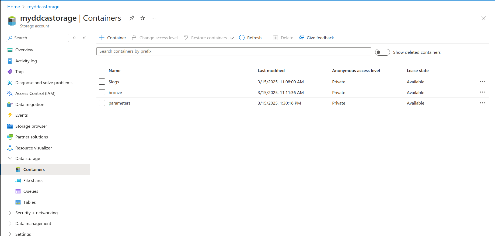

---

The Bronze directory contains the raw datasets pulled from GitHub.

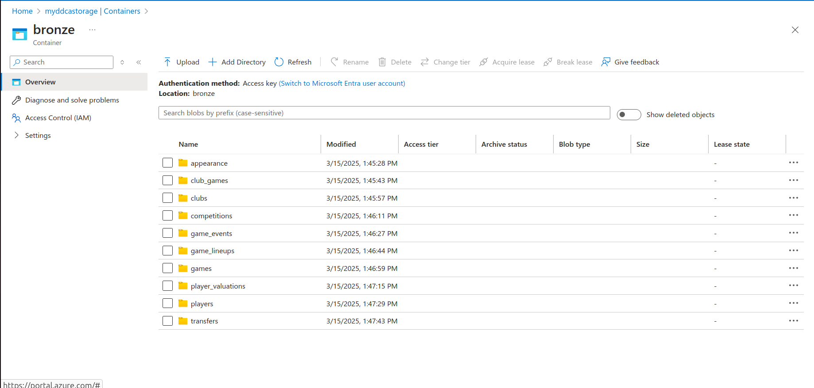

The Parameters directory contains a JSON file used in Azure Data Factory to pull the batch dataset. The JSON file contains configuration data about the source and destination of the dataset.

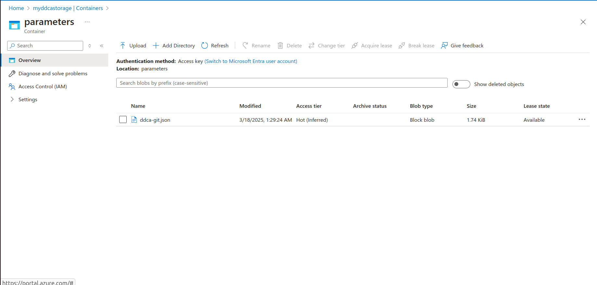

---

For demonstration purposes, we cleared the dataset from Bronze, and now it is empty. We did this to show that the automatic trigger is working. 
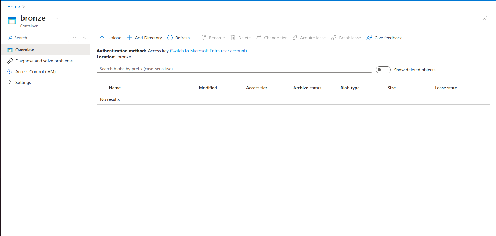

---

After clearing the folder, we scheduled the trigger to run at 12:30 PM on Sunday to capture these recordings.

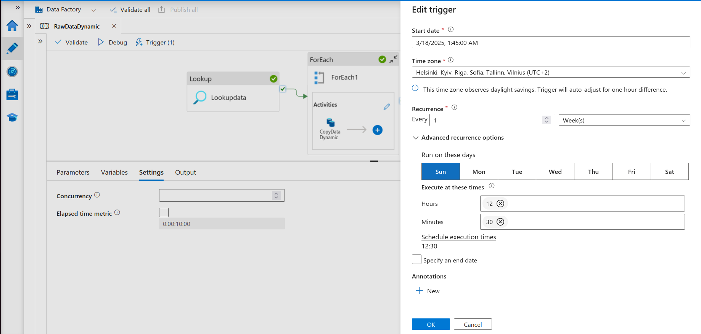

---

A few seconds after the trigger started running, we checked the Bronze folder and found that some files had already been loaded.

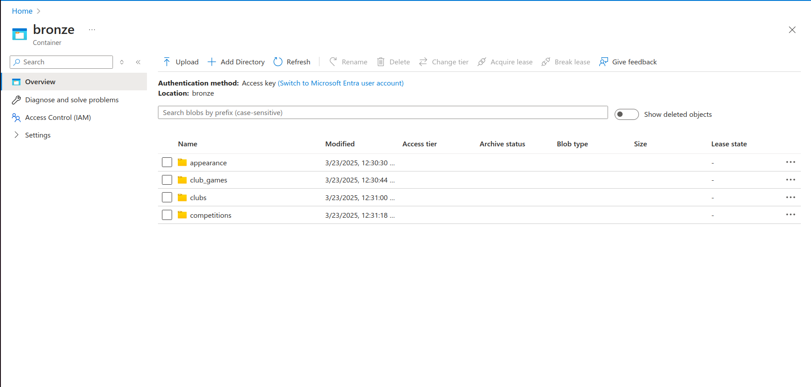

---

A couple of minutes later, the data pulling process was completed, and the Bronze directory at the ADLS container contained all the necessary files.

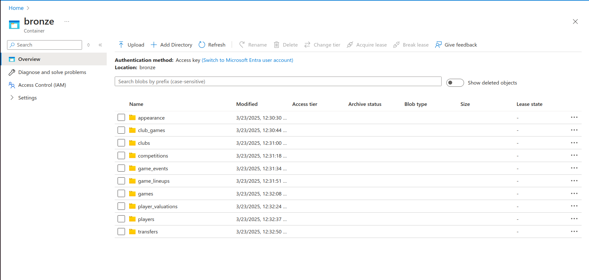

---

To demonstrate the possibility of running the data pulling pipeline manually, we ran (debugged) the data pulling pipeline in ADF manually. Below, you can see that the process was successful.

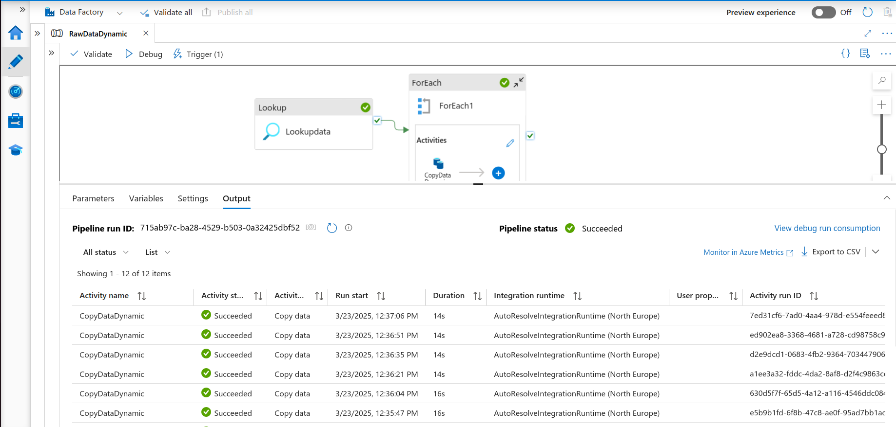

---

On the Databricks side, the data ingestion layer is configured to use the access key of the ADLS data storage. The data ingestion to the Bronze layer in Databricks was done automatically. The ETL pipeline in Databricks was managed to schedule and trigger automatically. Below are some screenshots taken from the ETL pipeline.

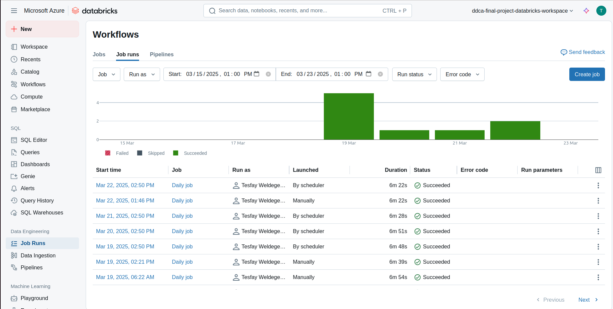

---

Here is a screenshot of the jobs with trigger details.

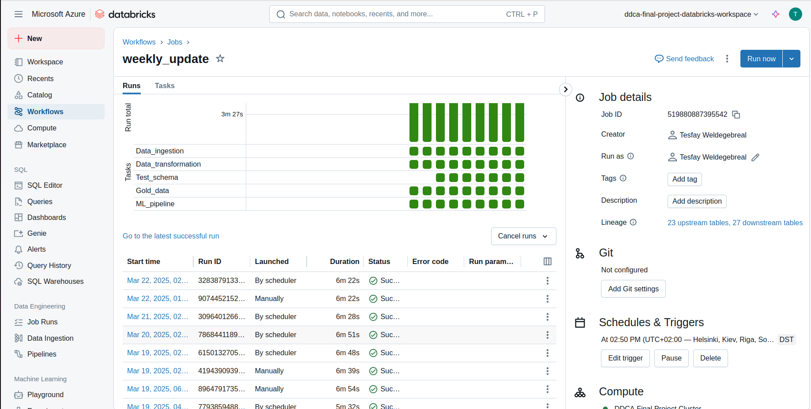

---

For demonstration purposes, the trigger was scheduled to run on Sunday at 12:48 PM after the completion of the ADF pipeline.

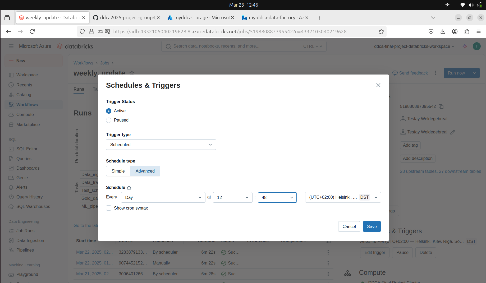

---

Here is a screenshot showing that the job started at the exact time the schedule was set to execute.

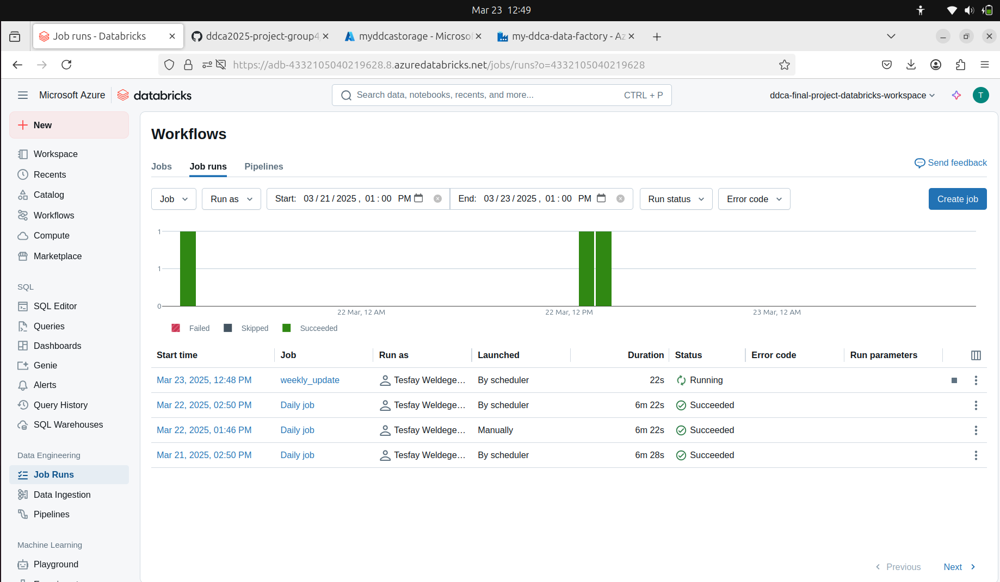

---

While the job of the pipeline was running, we checked the task of the job. As you can see in the screenshot below, the data ingestion part was completed, and the Silver layer was in progress.

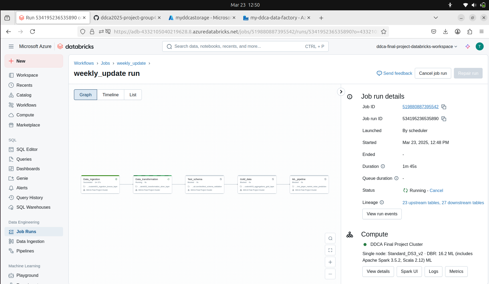

---

Finally, the triggered job was completed successfully. 
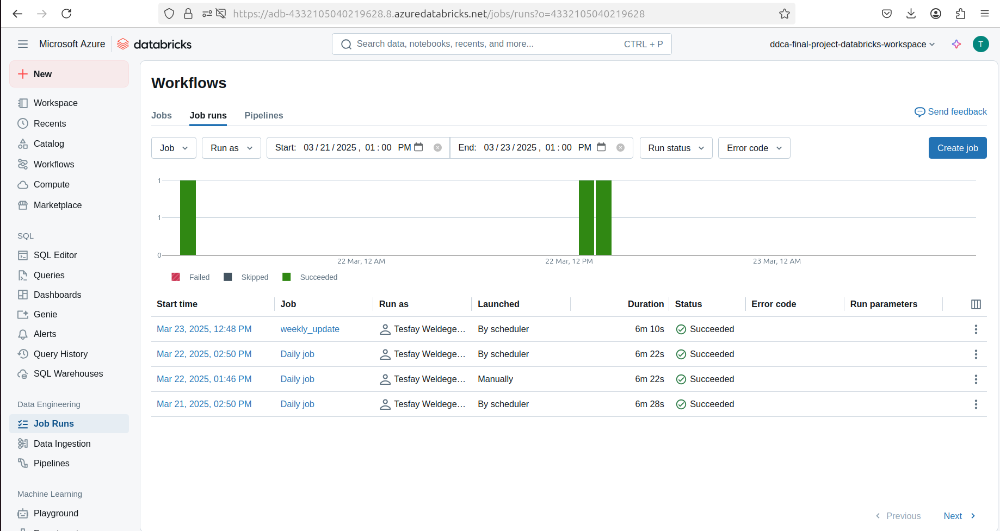

---

And every task under the job was completed successfully. 
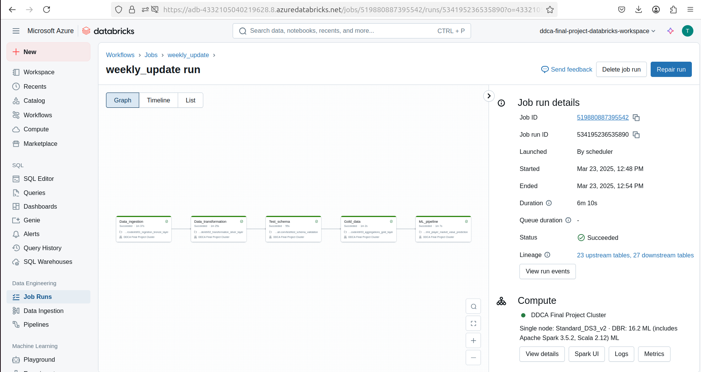

---

To show you how the tasks in the job were connected, here is a screenshot of the Silver layer task in the pipeline. It displays which notebook file and cluster were used and which task this task depends on.

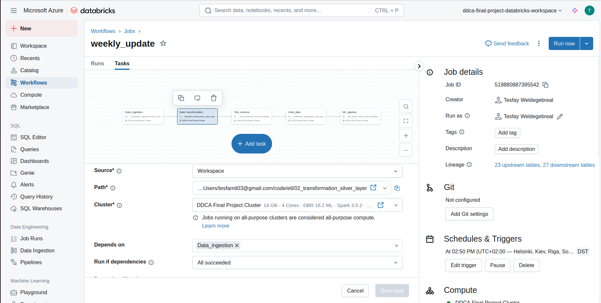

---

After the completion of the overall pipeline, we implemented data sharing. We created a public blob data storage container in Azure Data Storage. For ease of access, we created a public URL for the uploaded file, which enables anyone with the link to download and use the information.

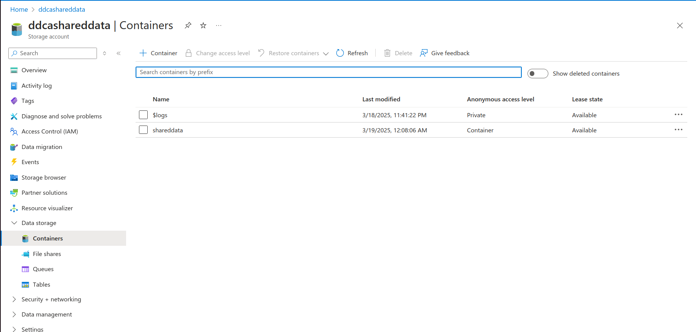

Example content of the data sharing container:
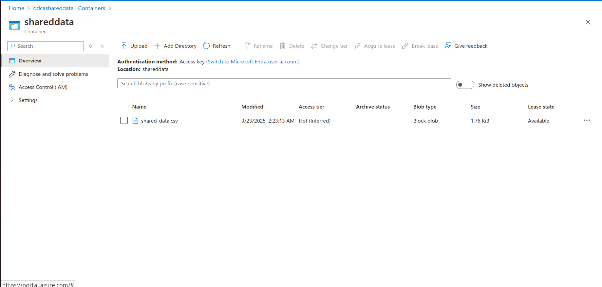

